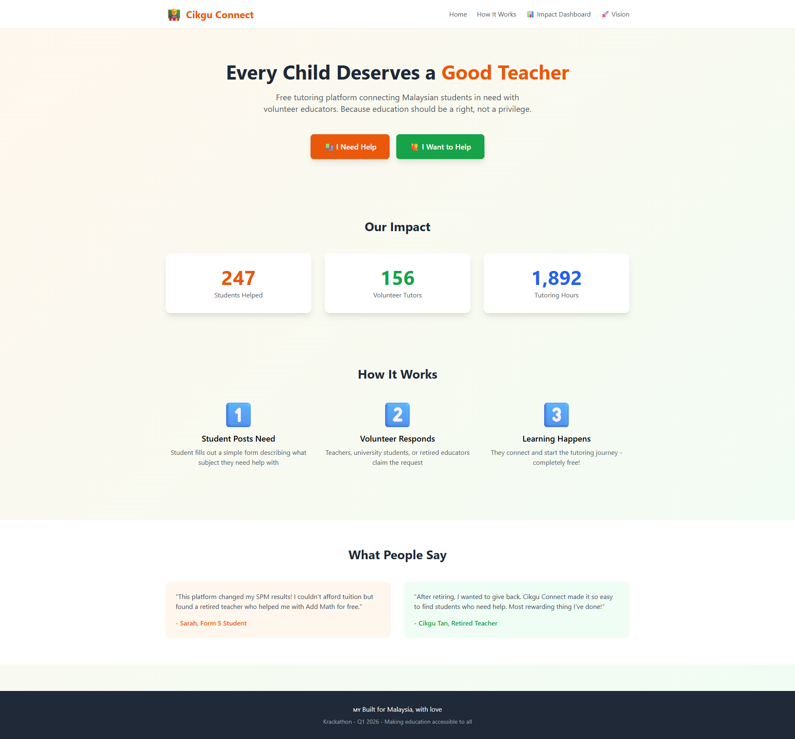
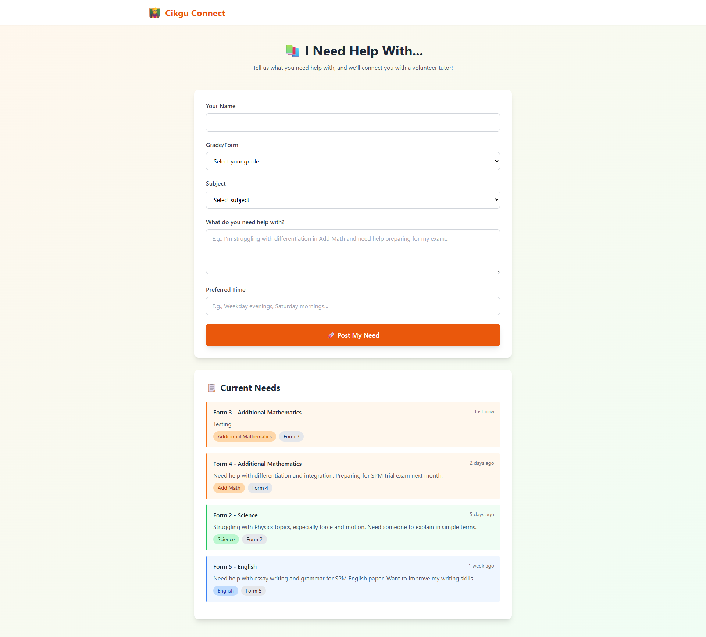
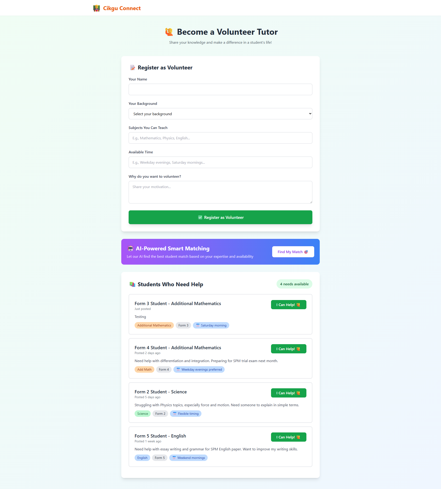
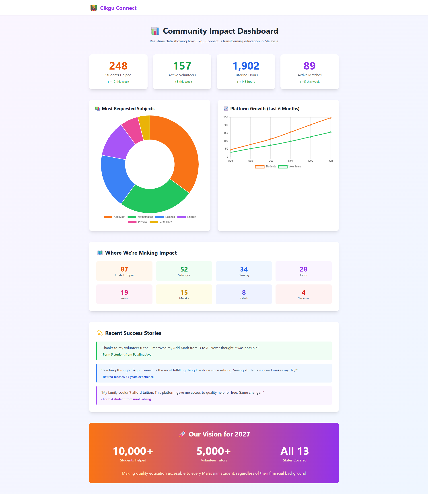
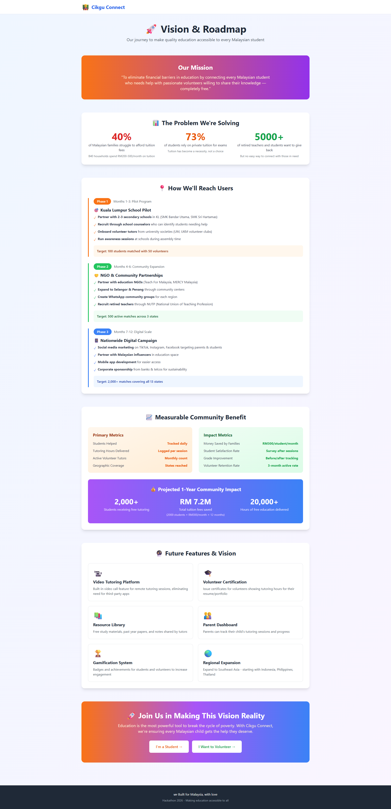

# 🎓 Cikgu Connect

**Free tutoring platform connecting Malaysian students in need with volunteer educators**

> *"Education should be a right, not a privilege"*

---

## 📌 The Problem

In Malaysia, private tuition has become increasingly unaffordable:
- B40 households spend RM200-500/month on tuition
- Private tutoring is often necessary for exam preparation
- Many potential volunteer tutors lack a platform to connect with students in need

---

## 💡 Our Solution

**Cikgu Connect** is a free, community-driven platform that bridges the gap between:
- 📚 **Students** who need help but can't afford expensive tuition
- 👨‍🏫 **Volunteer tutors** (retired teachers, current educators, university students) who want to share their knowledge

### Key Features

#### 1. Student Request System
Students can easily post their learning needs:
- Subject and grade level
- Specific topics they're struggling with
- Preferred tutoring schedule
- All completely anonymous and free

#### 2. Volunteer Tutor Matching
Volunteers can:
- Browse available student requests
- Claim matches based on their expertise
- Use **AI-powered smart matching** for optimal tutor-student pairing

#### 3. AI-Powered Smart Matching 🤖
Prototype demonstrates intelligent matching concept:
- Simulates analysis of tutor expertise and student needs
- Provides match confidence scores
- Shows potential for ML-based matching in production version

#### 4. Community Impact Dashboard 📊
Real-time visualization of platform impact:
- Students helped
- Tutoring hours delivered
- Geographic coverage across Malaysia
- Money saved by families
- Interactive charts showing growth trends

#### 5. Vision & Roadmap 🚀
Clear 3-phase deployment plan:
- **Phase 1**: KL school pilot (100 matches)
- **Phase 2**: Community expansion via NGOs (500 matches)
- **Phase 3**: Nationwide digital scale (2,000+ matches)

---

## 🎯 Impact Metrics

**Current Demo Shows:**
- **247** sample student profiles
- **156** sample volunteer tutors  
- **1,892** hypothetical tutoring hours
- **Geographic visualization** across Malaysian states

### Projected Real-World Impact (Year 1)
*If deployed and scaled according to roadmap:*
- **2,000+** students receiving free tutoring
- **RM 7.2 million** in tuition fees saved (2000 × RM300/month × 12 months)
- **20,000+** hours of education delivered
- Coverage across **all 13 states**

### Measurable Metrics
The platform tracks:
- Number of successful student-tutor matches
- Total tutoring hours delivered
- Geographic reach and coverage
- Student satisfaction ratings
- Money saved by families (RM300/student/month average)

---

## 🖥️ Screenshots

### Homepage

*Clean, welcoming interface explaining the platform's mission*

### Student Request Page

*Simple form for students to post their learning needs*

### Volunteer Dashboard with AI Matching

*Tutors can browse requests, claim matches, and use AI-powered matching*

### Community Impact Dashboard

*Data visualization showing platform's measurable community benefit*

### Vision & Roadmap

*Clear deployment plan and future vision*

---

## 🌐 Live Demo

**Visit the live platform:** [https://cikgu-connect.vercel.app](https://cikgu-connect.vercel.app)

### Try It Out:
1. **As a Student**: Click "I Need Help" to post a tutoring request
2. **As a Volunteer**: Click "I Want to Help" to browse needs and claim matches
3. **AI Matching**: Use the "Find My Match" feature for intelligent pairing
4. **View Impact**: Check the dashboard to see community metrics

---

## 🛠️ Tech Stack & Development Approach

### Frontend
- **HTML5** - Semantic markup
- **Tailwind CSS** - Modern, responsive styling via CDN
- **Vanilla JavaScript** - Interactive functionality
- **Chart.js** - Data visualization

### Development Process
- **AI-Assisted Development** - Built with Claude (Anthropic) as coding partner
- **Rapid Prototyping** - Vibe coding approach for fast iteration
- **First-Timer Friendly** - Designed and built by a hackathon first-timer

### Deployment & Hosting
- **Vercel** - Fast, reliable hosting with automatic deployments
- **GitHub** - Version control and collaboration

### Key Technical Features
- Responsive design (mobile-friendly)
- LocalStorage for demo data persistence
- Smooth animations and transitions
- Progressive enhancement approach
- No backend required - pure frontend solution

---

## 📋 Deployment Plan

### Phase 1: School Pilot (Months 1-3)
- Partner with 2-3 KL secondary schools
- Recruit through school counselors
- Onboard university student volunteers
- **Target**: 100 student-tutor matches

### Phase 2: Community Expansion (Months 4-6)
- Partner with education NGOs (Teach For Malaysia, MERCY)
- Expand to Selangor, Penang
- Create regional WhatsApp communities
- Recruit retired teachers via NUTP
- **Target**: 500 active matches

### Phase 3: Digital Scale (Months 7-12)
- Nationwide social media campaign
- Mobile app development
- Corporate sponsorships for sustainability
- **Target**: 2,000+ matches, all 13 states

---

## 🔮 Vision for Scale

### What This Could Become
*This hackathon prototype demonstrates core functionality. If scaled, here's what could make even bigger impact:*

- 📹 **Built-in Video Tutoring** - Integrated video calls
- 🎓 **Volunteer Certificates** - Digital recognition for tutors
- 📚 **Resource Library** - Shared study materials
- 👨‍👩‍👧 **Parent Dashboard** - Progress tracking
- 🏆 **Gamification** - Engagement features
- 🌏 **Regional Expansion** - Scale beyond Malaysia

---

**Built for Krackathon Q1 2026**

Created with Claude AI assistance | First-time hackathon project

---